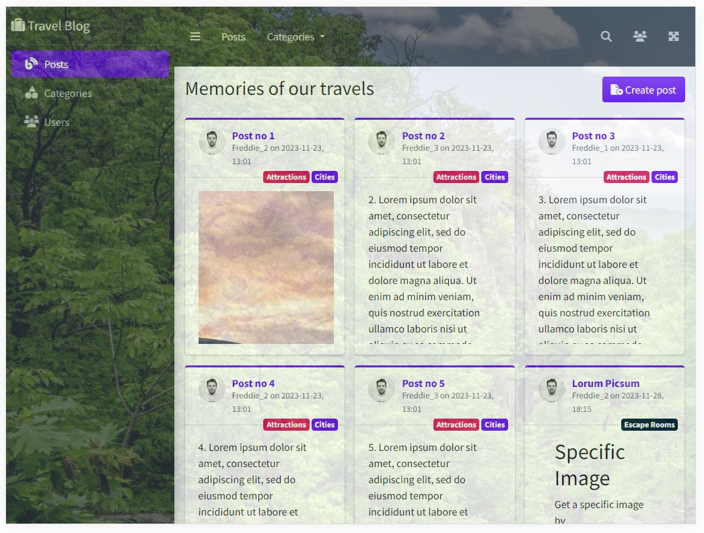

## PhP course

This project is meant to teach PhP fundamentals by creating a blog, step by step. It uses the [Bootstrap](https://getbootstrap.com/docs/4.6/getting-started/introduction/) framework and stores its data in [JSON](https://en.wikipedia.org/wiki/JSON) files.

This is how the final app looks like:



Follow these steps to continuously build a server-side Blog web app with PhP.

### 1. Data model
Create 3 model classes in the 'model' folder: `Post`, `User` and `Category`.

### 2. Test data 
Write scripts in the `scripts` folder that generate test data in JSON format in the `data` folder.

### 3. Controllers
Create controllers in the `controllers` folder that load and display the JSON data.

### 4. Views
Create PHP/HTML views in the `views` folder. Write a `view` function that loads data from the corresponding JSON file and loads the proper view template to display it.

### 5. UI framework
Chose a UI framework. We recommend:<br/>
1. [Bootstrap](https://getbootstrap.com/) or [Material Design Lite](https://getmdl.io/started/index.html)
2. search for a demo layout page and copy its HTML code to the `views\posts.php` file.<br/>
For example: [AdminLTE starter page](https://adminlte.io/themes/v3/starter.html)
3. open the `controllers\posts.php` page in your browser and check the result.
4. correct all the CSS, JS and image references using CDN links (for starters).
5. remove all unnecessary UI elements and place your own labels.

### 6. Layout template
Create a `layout template`. To do so, follow these steps:
1. create a `views\partials` sub-directory. 
2. cut out the code of HTML `<head>`, top navigation, sidebar and footer and paste it into their corresponding PhP files.
3. `require` all partials in the `loadView()` function.
4. create a `public` folder and `css`, `img`, `js` and `webfonts` sub-folders. Download the corresponding resources to these directories and modify the links to use the local copies.
5. tell the PhP server to use the `public` directory with these parameters:<br/>
`php -S localhost:8080 -t public`
   
### 7. Router 
Implement a basic router: 
1. inside `public\index.php`, insert this code:<br/>
   ```
   $uri = parse_url($_SERVER['REQUEST_URI'])['path'];
   $routes = [
     '/' => '../controllers/posts.php',
     '/posts' => '../controllers/posts.php',
     '/categories' => '../controllers/categories.php',
     '/users' => '../controllers/users.php'
   ];

   if(array_key_exists($uri, $routes)) {
     require $routes[$uri];
   } else {
     http_response_code(404);
     loadView("404");
   }
   ```
2. add an error page: `view\404.php`
3. add dynamic titles by adding a `$title` parameter to the `loadView($view, $title)` function. Pass a title in the corresponding controller. Example:
`loadView("posts", "Memories of our travels")`<br/>
Display that title in the view by using the `$title` variable: `<h1 class="m-0"><?= $title ?></h1>`
4. place the proper page links in the top-navbar and sidebar: `<a href="/posts" class="nav-link">Posts</a>`
5. highlight the current nav link in the sidebar by checking the `$view` variable: `<a href="/posts" class="nav-link <?= $view=='posts'? 'bg-indigo' : ''?>">`
   
### 8. 'Create post' feature
Implement the `create post` feature. For this:
1. create the `controllers\posts` directory and move `controllers\posts.php` to `constrollers\posts\index.php`. Correct all necessary links.
2. create the `views\posts` directory and move `views\posts.php` to `views\posts\index.php`. Correct all necessary links.
3. create both `controllers\posts\create.php` and `views\posts\create.php`.
4. in `public\index.php`, add this route to the `$routes`:<br/>
`'/posts/create' => BASE_PATH . '/controllers/posts/create.php'`
5. in `views\posts\create.php`, insert a HTML form with these fields:
   1. `title` as simple input field, 
   2. `categories[]` as multiple select box and
   3. `body` as textarea. You may use a rich text editor like [TinyMCE](https://www.tiny.cloud/).
   4. you may add [jQuery Validation](https://jqueryvalidation.org/) to it.
   5. add `method="post" action="/posts/save"` to the `<form>` tag.
   6. add `'/posts/save' => BASE_PATH . '/controllers/posts/store.php'` to the `$routes`.
6. in `functions.php`, write a `saveData($key, $newEntry)` function.
7. implement `controllers\posts\store.php`:
   1. create a new Post with the fields submitted in the form:<br/>
   `$newPost = new Post($_POST['title'], $_POST['body'], $_POST['userId'], $_POST['categories'])`
   2. save that post: `saveData('posts', $newPost)`
   3. redirect to the posts overview page: `header("location: /posts")`

### 9. 'Post detail' view
Implement the 'post detail' view:
1. create a new dynamic rule in the router:
   ```
   // check if `$uri` starts with 'posts'
   if (strpos($uri, "/posts/") == 0) {
      // parse any ID after the slash
      $postId = intval(substr($uri, 7));
      if ($postId) {
         require BASE_PATH . '/controllers/posts/read.php';
      }
   }
   ```
2. implement `controllers\posts\read.php`:<br/>
Get the current post by its id: `$post = $GLOBALS['posts'][$postId]`.
Load the detail view and pass the current post:
`loadView("posts/read", $post->title, ['post'=>$post])`      
3. create `views\posts\read.php`, showing the post's details.<br/>
Add a `close` button to return to the overview.

### 10. 'Delete post' feature
Implement the 'delete post' feature:
1. add a new rule to the routes:<br/>
`'/posts/delete' => BASE_PATH . '/controllers/posts/delete.php'`
2. in `views\posts\read.php`, add a 'delete' button that is only visible if the current user is identical to the post's user:<br/>
`if($_SESSION['currentUser'] == $post->userId)`
3. upon button click, show a dialog that asks: 'Do you really want to delete this post?'. 
4. in  the dialog, implement a small `<form method="post" action="/posts/delete">` with a hidden `<input name="postId" type="hidden" value="<?= $post->id ?>">`. 
5. create the `controllers\posts\delete.php` controller and insert this code:
   ```
   $postId = $_POST['postId'];
   unset($GLOBALS['posts'][$postId]);
   saveData('posts');
   header("location: /posts");
   ```

### 11. 'Edit existing post' feature
Implement the 'edit existing post' feature:
1. add a new rule to the routes:<br/>
   `'/posts/update' => BASE_PATH . '/controllers/posts/update.php'`
2. remember the current user id in a session variable. To do so, insert this code at the beginning of `loadView()`:
   ```
   if (!isset($_SESSION['currentUser'])) {
     session_start();
     // start with UserId = 2
     $_SESSION['currentUser'] = 2;
   }
   ```
3. only a post's author should have the right to edit it. So in `views\posts\read.php`, add an 'Edit' button that is only visible if the current user is identical to the post's user:<br/>
   `if($_SESSION['currentUser'] == $post->userId)`
4. add a small `<form method="post" action="/posts/update">` with a hidden `<input name="postId" type="hidden" value="<?= $post->id ?>">`.
5. create the `controllers\posts\update.php` controller and insert this code:
   ```
   $postId = $_POST['postId'];
   $post = $GLOBALS['posts'][$postId];
   if (!$post) {
     header("location: /posts");
   }
   loadView("posts/edit", "[Edit] " . $post->title, ['post' => $post]);
   ```
6. in `controllers\posts\create.php`, create a new, empty `Post` and pass it to the view:
   ```
   $newPost = new Post("", "", null, []);
   loadView("posts/edit", "New blog post", ['post' => $newPost]);
   ```
7. rename `views\posts\create.php` to `edit.php`. Insert these hidden fields right after the `<form>`:
   ```
   <input type="hidden" name="isExistingPost" value="<?=$post->userId ?>">
   <input type="hidden" name="id" value="<?= $post->id ?>">
   ```
8. fill all fields' values with the post's data:
   ```
   <input name="title" value="<?= $post->title ?>">
   <select name="categories[]">
   <?php foreach ($GLOBALS['categories'] as $category) : ?>
      <option value="<?= $category->id ?>"
          <?= $post->categories && in_array($category->id, $post->categories) ? 'selected' : '' ?> >
          <?= $category->name ?>
      </option>
   <?php endforeach; ?>
   <textarea name="body"><?= $post->body ?></textarea>
   ```
9. modify the code in `controllers\posts\save.php`:
   ```
   $isExistingPost = $_POST['isExistingPost'];
   // remove temporary field
   unset($_POST['isExistingPost']);

   if ($isExistingPost) {
     $postId = $_POST['id'];
     $post = $GLOBALS['posts'][$postId];
     if ($post) {
       // update the existing post with the <form> fields
       $GLOBALS['posts'][$postId] = array_merge((array)$post, $_POST);
       saveData('posts');
     }
   } else {
     $newPost = new Post($_POST['title'], $_POST['body'], intval($_POST['userId']), $_POST['categories']);
     saveData('posts', $newPost);
   }
   header("location: /posts");
   ```
### 12. 'Create and edit users' feature
Description will follow...
